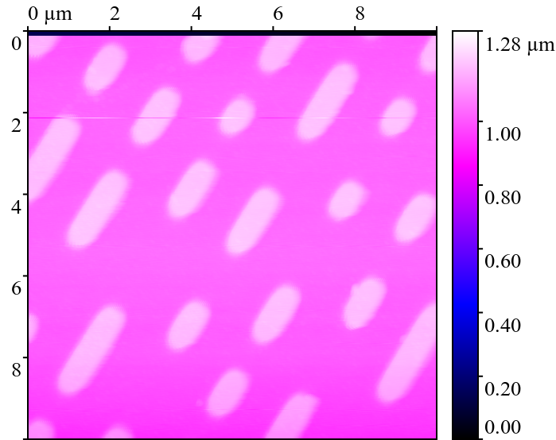
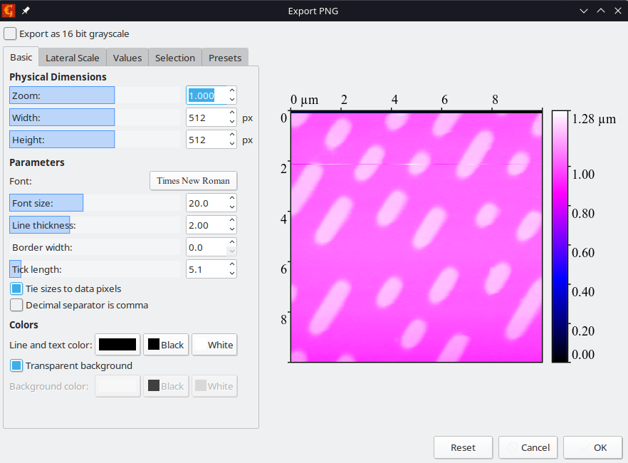

# Physics-lab-3-AFM

 The GitHub repositroy containing all the relevant information to the physics lab 3 AFM experiment

# Results
We may categorize the results into multiple categories, they are achieved by processing the different images corresponding to the different samples.
## Calibration sample
This can then be categorized into measurements obtained with the different calibration tips. In order to obtain the different values for the quantities mutliple measurements of distance were taken with the built-in tool within Gwyddion for the procedure and then these were combined into a csv file that was acessed in pyhton and then the value and standard deviation was calculated.deviation  

Therefore, for the dynamic hole size we obtain

- 4.5 ± 0.2  microns

And for the static the hole size we obtain is 

- 4.46 ± 0.08 microns

These are both quite a bit different than what we would expect from the data that we have been given.

## CD, DVD, Blu-Ray 

The measurements of the dimensions of the grooves were done in the same way as previously mentioned and then these were added to the calulcations of the storage density formula which we have to find somewhere in order to generate the respective values for the storage densities.  

For each of the samples (A1, A2, A3) we can calculate the parameters corresponding to the length of a bit in addition to the distance on the r axis (in polar coordinates with the origin the center of the disk and the plane in which the coordinates are defined the plane of the disk) in order to be able to determine the type of storage in additon to the storage density.

### Sample A1
The characteristics of this sample are:

- width of a bit: 1.04 ± 0.08 microns
- distance between lines: 1.73 ± 0.07 microns

As it has the highest dimensions we can conclude that this sample corresponds to the CD

Here we can see how the samples looks like

### Sample A2
The characteristics of this sample are:

- width of a bit: 0.36 ± 0.04 microns
- distance between lines: 0.73 ± 0.07 microns

### Sample A3

# Image processing 

The color map to be used is blue-cyan and then the image export parameters can be seen in the shortcut included below.

